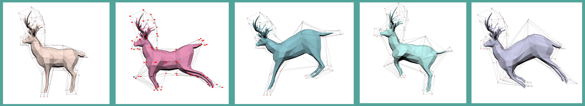
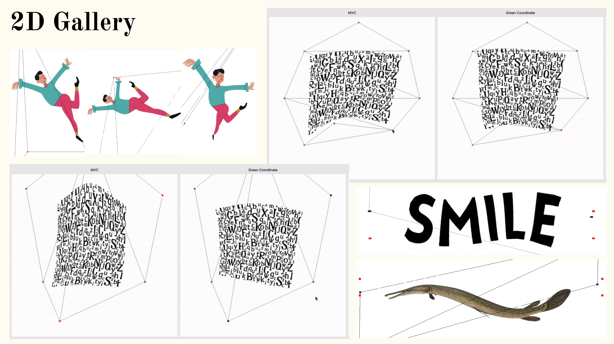
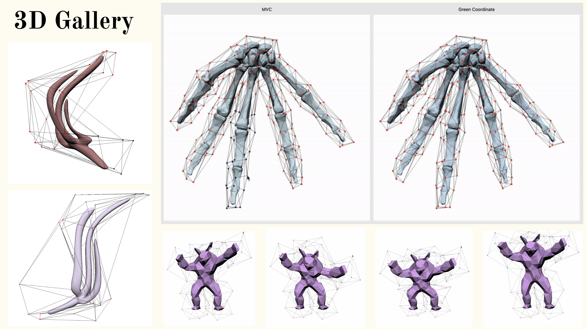
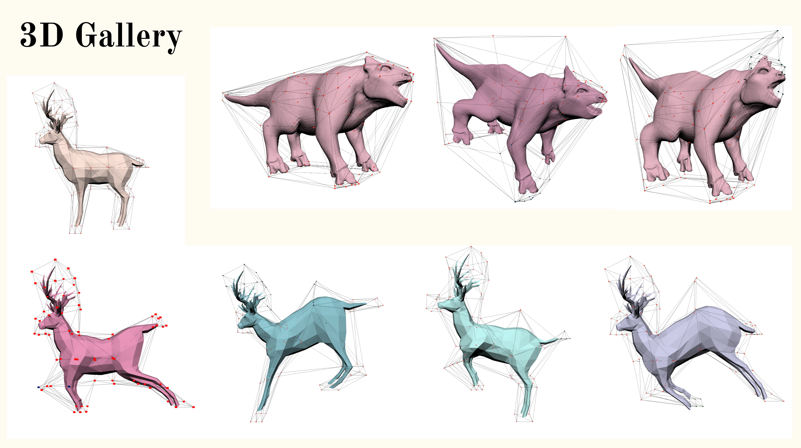

# Shape-Deformation-with-Green-Coordinates

**1. Project Overview:**

This is an interactive cage-based deformation program based on 4 papers. It allows the deformation of 2D and 3D shapes in Mean-Value-Coordinates and Green-Coordinates with both full and partial cage, and 2D deformation in high-order Green Coordinates in full cage.

|                               | 2D Full Cage       | 2D Partial Cage    | 3D Full Cage       | 3D Partial Cage    |
|-------------------------------|:------------------:|:------------------:|:------------------:|:------------------:|
| Green Coordinates             | Implemented [1]    | Implemented [1]    | Implemented [1]    | Implemented [1]    |
| Mean Value Coordinates        | Implemented [2]    | Implemented [2]    | Implemented [3]    | Implemented [3]    |
| Higher Order Green Coordinates| Implemented [4]    | -                  | -                  | -                  |

**2. Background:**

There exist two major categories of deformation methods: Directly modifying the shape geometry and shape-based deformation. The first kind, exemplifying with [ARAP](https://igl.ethz.ch/projects/ARAP/arap_web.pdf), mostly define a deformative energy and iteratively optimize it so that the energy is minimized. While it is considered as robust and simple, it also suffered the drawbacks of discretization and optimization errors, inconvenient control on large/dense meshes, and a relatively slow operation on extensive shapes.

Shape-based deformation, on the other hand, uses arbitrarily coarse proxy of shapes as cage to generate deformation. Modifying the cage vertices would correspondingly and smoothly deform the shape. It is both intuitive and easy to control and fast on dense meshes as well.

|            | Shape Geometry Deformation       | Cage Deformation    |
|------------|:--------------------------------:|:-------------------:|
| Method     | Define deformative energy and minimize it for shape preservation | Map all vertices on the mesh to an edge/face on the cage for deformation |
| Advantages | Robust and simple                  | Intuitive, Robust and Fast    |
| Drawbacks  | Discretization/optimization errors, inconvenient control, slow on dense meshes    | - |

In this program, we use a cage-based deformation system to demonstrate two kinds of barycentric coordinates: Mean-Value-Coordinates and Green Coordinates. MVC tend to enable strict affine deformation with cage movements, and Green Coordinate preserve shape in deformation. Their computation equation and derivation reference can be found in the following chart.

|                        | 2D MVC             | 2D Green           | 3D MVC             | 3D Green           |
|------------------------|:------------------:|:------------------:|:------------------:|:------------------:|
| Equation               | $\eta = F(\eta, P) = \sum \phi_i(\eta)\eta_i$    |$\eta = F(r, P) = \sum_{i \in I_v} (a_i m_i x_i) + \sum_{j \in I_f} (b_j h_j s_j(t_j))$    |  $\eta = F(\eta, P) = \sum \phi_i(\eta)\eta_i$    | $\eta=F(\eta ; P)=\sum_{i \in I_V} \sum_{n=0}^{N_c} \varphi_i^n(\eta) c_i^n+\sum_{j \in I_T} \sum_{n=0}^{N_c} \psi_j^n(\eta) c_j^{\perp}$ |
| Derivation Reference   | [2]    | [1] | [3]    | [1]    |

The derivation of Higher-order GC can be found in [literature [4]](https://dl.acm.org/doi/10.1145/3588432.3591499).

**3. Video Demos**

1. [2D Checkboard](https://drive.google.com/file/d/1Tv90_fNeY3msEWVUe6MKIQjMk2p1p7Hs/view?resourcekey) This is a comparison between standard 2D MVC and Green Coordinates.
   
   
2. [2D Textbox](https://drive.google.com/file/d/1eL7cK24PDWqYp1cIfKZ9WoCwSlH22cfV/view?resourcekey) This compares the effects between 2D MVC and Green Coordinates on a long polygon. Shape is preserved better in Green Coordinates.
   
   
3. [2D Polygon](https://drive.google.com/file/d/1Y2jMKp0Q78xqYkU0DVxVk2EkSoMKLAoM/view?resourcekey) This deforms in a non-regular geometric shape.
   
   
4. [2D Partial cage](https://drive.google.com/file/d/1rzItOy5FuhK3ILUQJuMyod_5LOBUMP9s/view?resourcekey) This is a demonstration of how partial cage (when the cage does not fully contain the object) work for MVC and Green Coordinates.
   
   
5. [2D Higher Order Green Coordinate](https://drive.google.com/file/d/1P3DTDgx6zwGS-er37GczWgRKbHiA7IeV/view?resourcekey) This demonstrates the difference between Normal Green Coordinates and Higher Order Green Coordinates.
   | Linear Green Coordinates | Cubic Green Coordinates |
   |--------------------------|-------------------------|
   |  |  |

6. [3D Comparison](https://drive.google.com/file/d/1JZJuo6hvgi2CI2oz2v3cUJzgsg5bKquL/view?resourcekey) This shows the comparison between MVC and Green Coordinates on 3D meshes.
    
    
   

7. [Dense Meshes](https://drive.google.com/file/d/19qOvTyO6YCqAK_aAb3zB-NklKSfiVfhZ/view?resourcekey) Performance presentation on very dense 3D mesh shapes.
    

**4. Gallery**

**5. Running the Code**

The program requires manual input of cage and mesh shape - both be in .obj file format. If rendering in 2D, all values on Z-axis need to be set to 0 and an image must be passed in as texture as well. After the code successfully compiles, there will be a UI with 5 buttons. Load in cage, mesh and image, then click render2D/render3D based on the type of obj file passed in. The vertices on the cages can be selected - unselected vertices will remain unchanged when deforming.

**6. Cage Generation**

There are 3 approaches in attempted cage generation algorithm.
Method 1: Iteratively inflate along the normal of each face, then conduct quadratic simplification for the inflated shape.
Method 2: Compute the convex hull of the inflated mesh shape
Method 3: Voxelization and triangulation of the bounding box (create a bounding box, voxelize it, preserve the voxels that intersect with the mesh surface, then conduct triangulation & simplification on it).
We attempted method 3 under the instruction of [this paper](http://www.cad.zju.edu.cn/home/hwlin/pdf_files/Automatic-generation-of-coarse-bounding-cages-from-dense-meshes.pdf) and [Benjamin Barral's implementation](https://github.com/BenjBarral/Cage-Based-Deformation-MVC). However, the output of this method is not ideal for the following reasons:
1. The output cage do not fully contain the mesh shape.
2. The cage does not preserve the original mesh shape's features well enough.
3. The cage might have some compromised normals.
Please check [our presentation Powerpoint](https://docs.google.com/presentation/d/1sWqiZ9bn0oQjIBL6exVA91wCfn0Mvm8iWtjkzzziVLQ/edit#slide=id.g2dad409eede_0_63) (the hidden pages) for detailed steps and conjectures about the sources of these problems. 

**7. References:**

References can be found here:

[1] Lipman, Y., Levin, D., & Cohen-Or, D. (2008). Green coordinates. ACM transactions on graphics (TOG), 27(3), 1-10.(https://dl.acm.org/doi/10.1145/1360612.1360677#:~:text=The%20coordinates%20are%20motivated%20by,with%20a%20shape%2Dpreserving%20property.)

[2] Hormann, K., & Floater, M. S. (2006). Mean value coordinates for arbitrary planar polygons. ACM Transactions on Graphics (TOG), 25(4), 1424-1441.(https://dl.acm.org/doi/10.1145/1183287.1183295)

[3] Ju, T., Schaefer, S., & Warren, J. (2023). Mean value coordinates for closed triangular meshes. In Seminal Graphics Papers: Pushing the Boundaries, Volume 2 (pp. 223-228).(https://www.cse.wustl.edu/~taoju/research/meanvalue.pdf)

[4] Michel, É., & Thiery, J. M. (2023, July). Polynomial 2D Green Coordinates for Polygonal Cages. In ACM SIGGRAPH 2023 Conference Proceedings (pp. 1-9).](https://dl.acm.org/doi/10.1145/3588432.3591499)
